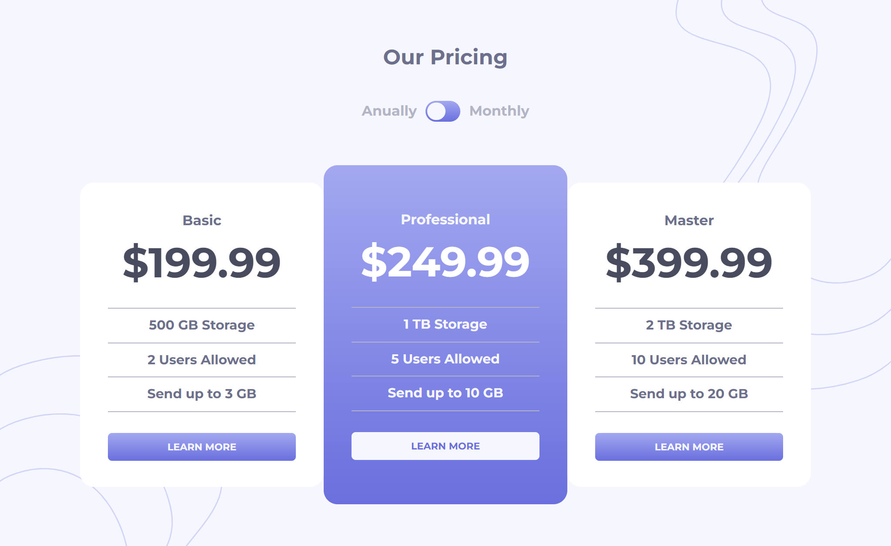
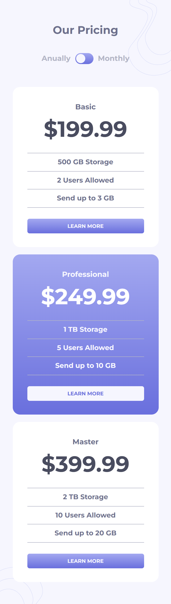

# Frontend Mentor - Pricing component with toggle solution

This is a solution to the [Pricing component with toggle challenge on Frontend Mentor](https://www.frontendmentor.io/challenges/pricing-component-with-toggle-8vPwRMIC). F

### The challenge

Users should be able to:

- View the optimal layout for the component depending on their device's screen size
- Control the toggle with both their mouse/trackpad and their keyboard

### Screenshot

### Links

- Solution URL: [GitHub](https://github.com/juanmderosa/pricing-component)
- Live Site URL: [GitHub Pages](https://juanmderosa.github.io/pricing-component/)

## My process

### Built with

- Semantic HTML5 markup
- CSS custom properties
- SASS
- Flexbox
- Responsive Design workflow
- [React](https://reactjs.org/) - JS library

## Author

- Website - [Juan Martín De Rosa](https://juanmderosa-developer.com/)
- Frontend Mentor - [@juanmderosa](https://www.frontendmentor.io/profile/juanmderosa)
- Linkedin - [Juan Martín De Rosa](https://www.linkedin.com/in/juanmderosa/)

